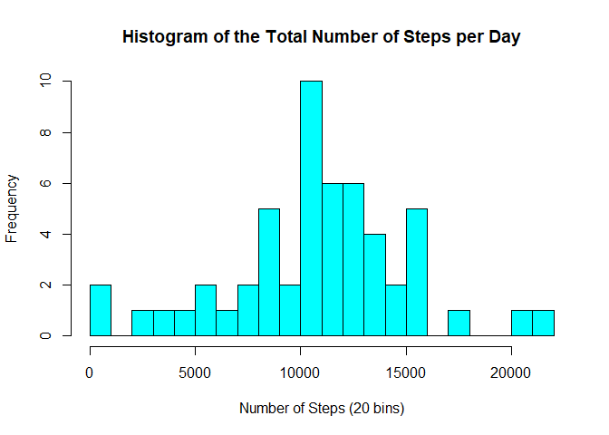

Introduction
------------

This assignment showcases my ability to conduct some data analysis and
make use of R markdown and knitr. This project will makes use of data
from a personal activity monitoring device. This device collects data at
5 minute intervals through out the day. The data consists of two months
of data from an anonymous individual collected during the months of
October and November, 2012 and include the number of steps taken in 5
minute intervals each day.

This dataset can be found here: [Activity monitoring
dataset](https://d396qusza40orc.cloudfront.net/repdata%2Fdata%2Factivity.zip)

This assignment contains a number of steps, shown below:

Loading and Preprocessing the Data
----------------------------------

### 1) Loading the data

    # Load necessary packages
    library(dplyr)

    # Set working directory, save the zip file URL, and the zip file name
    setwd("~/GitHub/RepData_PeerAssessment1")
    zip_url <- "https://d396qusza40orc.cloudfront.net/repdata%2Fdata%2Factivity.zip"
    zip_file <- "repdata_data_activity.zip"

    # Names of the csv file that is contained in the zip file
    activity_csv <- "activity.csv"

    # Checks if the above file exists. If not, checks to see if the zip file is in
    # the directory, if not, then downloads the zip file.
    # The zip file is then unzipped and the zipfile is then removed from the working
    # directory.

    if (!(file.exists(activity_csv))){
            if (!file.exists(zip_file)) {
                    download.file(zip_url, zip_file, method = "curl")
            }
            
            # Unzip the zip file
            unzip(zip_file)
            
    }

    activity_data <- read.csv(activity_csv, na.strings = "NA")

### 2) Process/transform the data

    # Change date class from default Factor class to Date class
    activity_data <- activity_data %>% mutate(date = as.Date(date, format= "%Y-%m-%d"))

    str(activity_data)

    ## 'data.frame':    17568 obs. of  3 variables:
    ##  $ steps   : int  NA NA NA NA NA NA NA NA NA NA ...
    ##  $ date    : Date, format: "2012-10-01" "2012-10-01" ...
    ##  $ interval: int  0 5 10 15 20 25 30 35 40 45 ...

Mean Total Number of Steps Taken per Day
----------------------------------------

### 1) Calculate the total number of steps taken per day

    # Calculate the total sum of steps per day
    steps_per_day <- aggregate(steps ~ date, activity_data, sum)

### 2) Histogram of the total number of steps taken each day

    # Plot a histogram with 20 breaks (bins of 1,000 steps)
    hist(steps_per_day$steps, main = "Histogram of the Total Number of Steps per Day",
         xlab = "Number of Steps (20 bins)", col = "cyan", breaks = 20)

### 3) Mean and median number of steps taken each day

    # Calculate the total mean and median using the steps per day
    total_mean <- mean(steps_per_day$steps)
    total_median <- median(steps_per_day$steps)

-   mean of all days: 1.076618910^{4}
-   median of all days: 10765

Average Daily Activity Pattern
------------------------------

### 1) Time series plot of the 5-minute interval and the average number of steps taken, averaged across all days

    mean_steps_per_interval <- aggregate(steps ~ interval, activity_data, mean)

    # Plot of the average number of steps per 5-Minute Interval
    with(mean_steps_per_interval, plot(interval,steps, col = "red", typ = "l",
                                  lwd = 2, main = "Average of Number of Steps 5-Minute Interval",
                                  xlab = "Intervals", ylab = "Average Number of Steps"))

### 2) Time series plot of the 5-minute interval and the average number of steps taken, averaged across all days

    # Arrange the dataframe with descending average number of steps
    sorted_mean_steps_per_interval <- arrange(mean_steps_per_interval,-steps)
    max_steps <- sorted_mean_steps_per_interval$steps[1]
    max_interval <- sorted_mean_steps_per_interval$interval[1]

-   The maximum average number of steps that occurs during a 5-minute
    interval is: 206.1698113  
    This coresponds to interval: 835

Imputing Missing Values
-----------------------

### 1) Total number of missing values in the datase

    count_na <- sum(is.na(activity_data$steps))

-   There are 2304 days/intervals where there is missing values.

### 2) Imputing missing values & 3) New dataset without missing data

    imputted_activity_data <- activity_data

    # Repeat the mean steps per interval 61 times (17568 total observations / 288 intervals)
    rep_mean_time_intervals <- rep(mean_steps_per_interval$steps, 61)

    # For loop and if statement to check if steps = "NA", if so, replace with mean interval time
    for (i in 1:nrow(imputted_activity_data)){
      if(is.na(imputted_activity_data$steps[i]))
        {imputted_activity_data$steps[i] <- rep_mean_time_intervals[i]}
    }

    # Check if all NA's have been removed
    sum(is.na(imputted_activity_data$steps))

    ## [1] 0

4a) Make a histogram of the total number of steps taken each day
----------------------------------------------------------------

    # Calculate the total sum of steps per day
    imputted_steps_per_day <- aggregate(steps ~ date, imputted_activity_data, sum)

    # Plot a histogram with 20 breaks (bins of 1,000 steps)
    hist(imputted_steps_per_day$steps, main = 
           "Histogram of the Total Number of Steps per Day: Imputted Dataset", 
         xlab = "Number of Steps (20 bins)", col = "green", breaks = 20)

4b) Calculate and report the mean and median total number of steps taken per day
--------------------------------------------------------------------------------

    # Not clear if we are to calculate the total mean and median across all days
    imputted_total_mean <- mean(imputted_steps_per_day$steps)
    imputted_total_median <- median(imputted_steps_per_day$steps)

-   Imputted dataset mean of all days: 1.076618910^{4}
-   Imputted dataset median of all days: 1.076618910^{4}

4c) How these new values differ compared to the the first part of the assignment
--------------------------------------------------------------------------------

    # Not clear if we are to calculate the total mean and median across all days
    dif_mean <- imputted_total_mean - total_mean
    dif_median <- imputted_total_median - total_median

-   Imputted dataset mean is the same as the mean from the first part: A
    difference of: 0
-   Imputted dataset median is slightly greater compared to median from
    the first part by 1.1886792  
    This indicates that it is reasonable to remove NA values from this
    analysis

Differences in Activity Patterns Between Weekdays and Weekends
--------------------------------------------------------------

### 1) Create a new factor variable in the dataset with two levels – “weekday” and “weekend”

    # Create new colum with the day of the week
    # The wday component of a POSIXlt object is the numeric weekday (0-6 starting on Sunday)
    imputted_activity_data$day <- as.POSIXlt(imputted_activity_data$date)$wday

    # Create new factor based on if the day is a weekday or a weekend
    imputted_activity_data$day.type <- ifelse(imputted_activity_data$day %in% c(0,6), "weekend", "weekday")

    library(ggplot2)

    imputted_mean_steps_per_interval <- aggregate(steps ~ interval + day.type, imputted_activity_data, mean)

    # Plot of the average number of steps per 5-Minute Interval

    g_plot <- ggplot(imputted_mean_steps_per_interval, aes(interval, steps, color = day.type))
    g_plot <- g_plot + geom_line() + facet_grid(day.type ~ .) + xlab("Intervals") + 
              ylab("Average Number of Steps") + ggtitle("Average of Number of Steps 5-Minute Interval: Imputted") +
              theme(strip.text.y = element_blank())

    print(g_plot)

